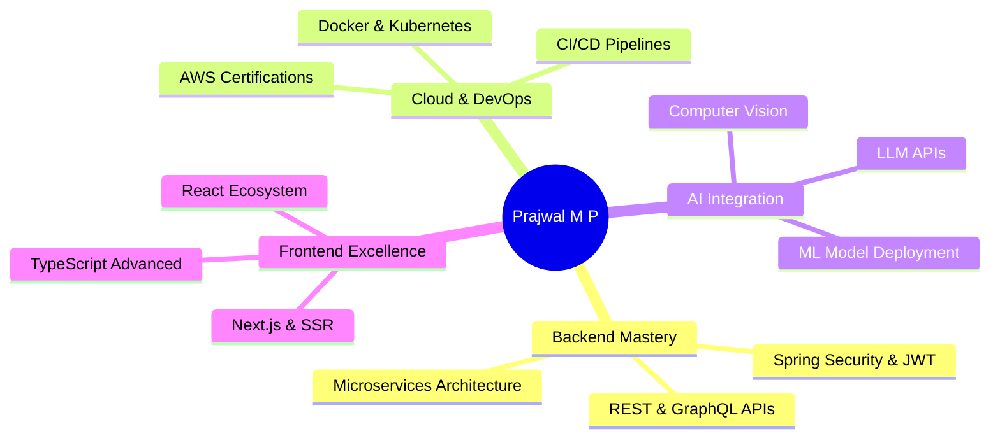

<div align="center">

<!-- Animated Header Banner -->


<!-- Typing SVG -->
<a href="https://git.io/typing-svg">
  
</a>

<br/>

<!-- Profile Views & Followers -->

&nbsp;


</div>

---

<!-- About Me Section -->


## 🧑‍💻 About Me

```yaml
name: "Prajwal M P"
role: "Java Full Stack Developer"
location: "India 🇮🇳"
open_to: "Global Opportunities 🌍"

experience:
  - "8-Month Java Full Stack Intern @ Dyashin Technosoft Pvt Ltd"

passions:
  - "Clean Code & System Design"
  - "AI-Powered Applications"
  - "Cloud Architecture"
  - "Real-World Problem Solving"

currently_learning:
  - "Spring Security & Microservices"
  - "Cloud Deployments (AWS/Azure/GCP)"
  - "AI & ML Integration"

fun_fact: "I debug with console.log AND sysout! ☕"
```

<br clear="right"/>

---

## 🌐 Connect With Me

<div align="center">

[](https://www.linkedin.com/in/prajwal-m-p-190131246/)
[](https://github.com/Prajwalps2603)
[-000000?style=for-the-badge&logo=x&logoColor=white)](https://x.com/PrajwalNair2603)
[](https://www.instagram.com/prajwal_shobha/)
[](mailto:prajwalnair2603@gmail.com)
[](https://paypal.me/prajwalps2603)

</div>

---

## ⚡ Tech Stack & Skills

### 🖥️ Languages
<div align="center">


</div>

### 🔧 Backend & Frameworks
<div align="center">


</div>

### 🎨 Frontend & UI
<div align="center">


</div>

### 🗄️ Databases
<div align="center">


</div>

### ☁️ Cloud & DevOps
<div align="center">


</div>

### 🤖 AI / ML & Data Science
<div align="center">


</div>

### 🛠️ Tools & Platforms
<div align="center">


</div>

---

## 🚀 Featured Projects

<div align="center">

<table>
  <tr>
    <td align="center" width="50%">
      <a href="https://github.com/Prajwalps2603/Drone-Intelligence-System">
        
      </a>
      <br/>
      <sub>🚁 <b>Drone Intelligence System</b> — AI-powered autonomous drone control & navigation</sub>
    </td>
    <td align="center" width="50%">
      <a href="https://github.com/Prajwalps2603/Human_Brain_Tumor_Detection">
        
      </a>
      <br/>
      <sub>🧠 <b>Brain Tumor Detection</b> — Deep learning MRI classification using CNN & TensorFlow</sub>
    </td>
  </tr>
  <tr>
    <td align="center" width="50%">
      <a href="https://github.com/Prajwalps2603/Audify-AI">
        
      </a>
      <br/>
      <sub>🎵 <b>Audify AI</b> — AI-powered audio streaming & smart music recommendation platform</sub>
    </td>
    <td align="center" width="50%">
      <a href="https://github.com/Prajwalps2603/LifeSync">
        
      </a>
      <br/>
      <sub>💡 <b>LifeSync</b> — Smart productivity & life management web application</sub>
    </td>
  </tr>
  <tr>
    <td align="center" width="50%">
      <a href="https://github.com/Prajwalps2603/portfolio">
        
      </a>
      <br/>
      <sub>🌐 <b>Portfolio</b> — Personal portfolio website showcasing projects & skills</sub>
    </td>
    <td align="center" width="50%">
      <a href="https://github.com/Prajwalps2603/MarkVault-Smart-BooKMark-App">
        
      </a>
      <br/>
      <sub>🔖 <b>MarkVault</b> — Smart bookmark manager with AI-powered tagging & search</sub>
    </td>
  </tr>
</table>

<br/>

[](https://github.com/Prajwalps2603?tab=repositories)

</div>

---

## 📊 GitHub Statistics

<div align="center">


</div>

<div align="center">


</div>

---

## 🏆 GitHub Trophies

<div align="center">


</div>

---

## 📈 Contribution Activity

<div align="center">

[](https://github.com/ashutosh00710/github-readme-activity-graph)

</div>

---

## 🎯 Current Goals



---

## 🌟 Developer Philosophy

<div align="center">

> *"First, solve the problem. Then, write the code."* — John Johnson

> *"Clean code always looks like it was written by someone who cares."* — Robert C. Martin

</div>

---

## 📅 Weekly Coding Activity

<!--START_SECTION:waka-->
> 🔐 *WakaTime stats will appear here once configured.*
<!--END_SECTION:waka-->

---

<div align="center">

<!-- Snake Animation -->
<picture>
  <source media="(prefers-color-scheme: dark)" srcset="https://raw.githubusercontent.com/Prajwalps2603/Prajwalps2603/output/github-snake-dark.svg" />
  <source media="(prefers-color-scheme: light)" srcset="https://raw.githubusercontent.com/Prajwalps2603/Prajwalps2603/output/github-snake.svg" />
  
</picture>

</div>

---

<div align="center">

<!-- Footer Wave -->


**⭐ Star my repos if you find them helpful! Let's connect and build something amazing together 🚀**

[](https://visitcount.itsvg.in)

</div>

